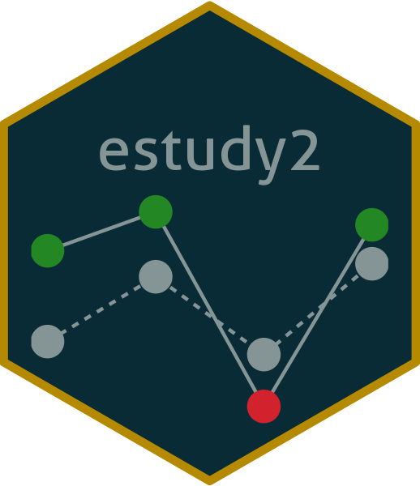

<!-- README.md is generated from README.Rmd. Please edit that file -->

# estudy2 

[](https://api.travis-ci.org/irudnyts/estudy2.svg?branch=master)
[](https://ci.appveyor.com/project/irudnyts/estudy2)
[](https://CRAN.R-project.org/package=estudy2)
[](https://cranlogs.r-pkg.org/badges/grand-total/estudy2?color=brightgreen)

## Overview

An implementation of a most commonly used event study methodology,
including both parametric and nonparametric tests. It contains variety
aspects of the rate of return estimation (the core calculation is done
in C++), as well as three classical market models: mean adjusted
returns, market adjusted returns and single-index market models. There
are 6 parametric and 6 nonparametric tests provided, which examine
cross-sectional daily abnormal return (see the documentation of the
functions for more information). Furthermore, tests for the cumulative
abnormal returns are included.

## Installation

To install a current stable release from CRAN use:

``` r
install.packages("estudy2")
```

To install the development version of estudy2 use:

``` r
# install.packages("devtools")
# library("devtools")
devtools::install_github("irudnyts/estudy2")
```

## Demo

The package is equipped with a demonstration Shiny app that can be run
locally with:

``` r
library("estudy2")
run_app()
```

Otherwise, one can explore the deployed version using this
[link](https://irudnyts.shinyapps.io/estudy2/).
